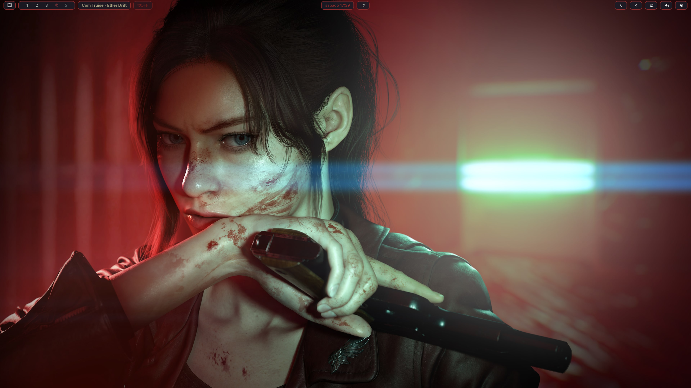
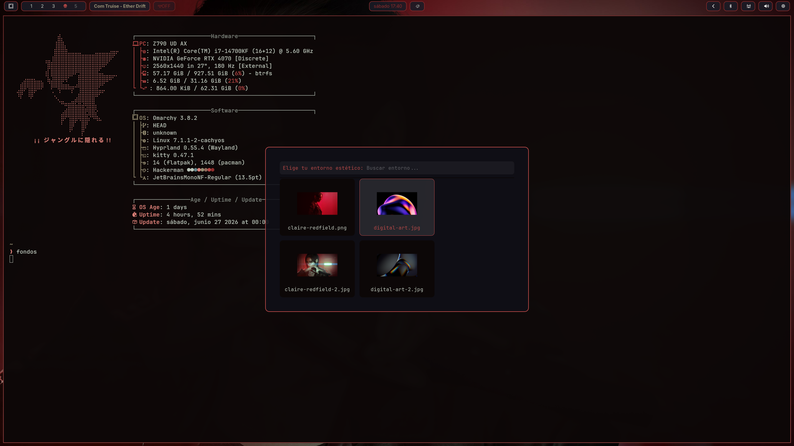
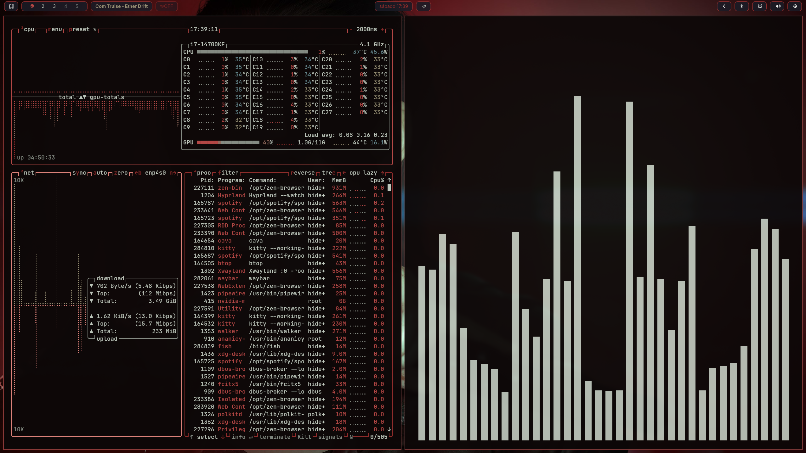
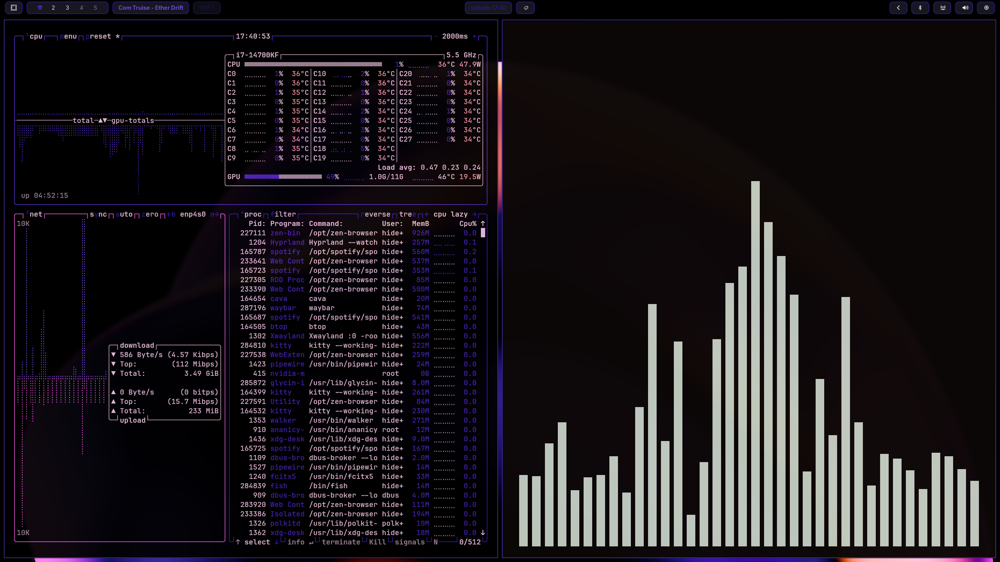
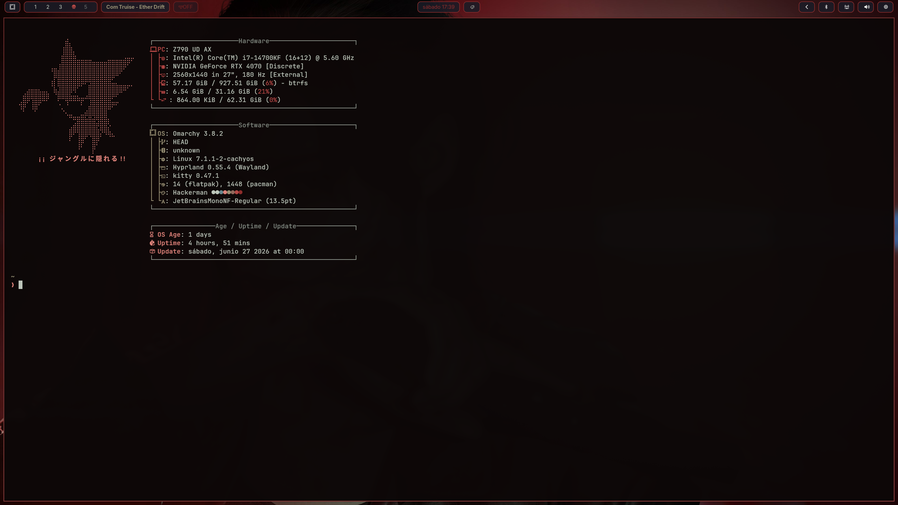

# Dotfiles - CachyOS/Arch Linux Setup

<p align="center">
    
</p>

Mi configuración personal de entorno de trabajo para **Arch Linux / CachyOS + Omarchy**, enfocada en rendimiento, seguridad y estética personalizada.

## 🛠️ Tecnologías y Herramientas
* **Base OS:** CachyOS (Arch Linux) — Instalación mínima por CLI (sin un entorno de escritorio)
* **Framework / Base:** Omarchy
* **WM:** Hyprland (Wayland)
* **Barra:** Waybar (con configuración personalizada y glifos especiales)
* **Terminal:** kitty + fish
* **Editor:** Zed (con integración Vim)
* **Gestión de Red:** `iproute2` y utilidades de seguridad.

## 📸 Demostración visual

### Selector de entorno estético (Rofi grid + previsualizaciones)
Integración personalizada para previsualizar los fondos disponibles en una cuadrícula dinámica antes de aplicarlos
<p align="center">
    
</p>

### Paletas de colores dinámicas (Pywal Integration)
El script `cambiar_fondo.sh` automatiza la regeneración completa del entorno, adaptando los bordes de Hyprland, Waybar, Kitty y herramientas del sistema en cuestión de milisegundos según el esquema del wallpaper:

| Entorno temático rojo (Claire Redfield, RE:Code Verónica Remake) | Entorno temático morado (Digital Art) |
| :---: | :---: |
|  |  |

### Especificaciones del entorno
<p align="center">
    
</p>
## 🚀 Instalación
Este repositorio utiliza un **directorio Git bare** para gestionar los archivos de configuración directamente en `$HOME` sin necesidad de enlaces simbólicos.

### Inicialización
```bash
# Clonar el repositorio
git clone --bare git@github.com:hideonn1/cachyOS-on-omarchy-dotfiles-hideonn1.git $HOME/.dotfiles
```

### Definir el alias de gestión
```bash
alias config='/usr/bin/git --git-dir=$HOME/.dotfiles/ --work-tree=$HOME'
```

### Desplegar archivos
```bash
config checkout
```

## ⚙️ Uso
Para gestionar tus archivos de configuración, utiliza siempre el alias config en lugar de git:

```bash
# Ver estado:
config status

# Añadir un nuevo archivo:
config add .config/tu-archivo

# Commit:
config commit -m "Descripción del cambio"

# Subir/empujar cambios:
config push
```

## 🌌 Colección de Wallpapers

Los fondos de pantalla utilizados en este entorno (incluyendo el arte de Claire Redfield y las piezas de diseño digital) se actualizan y gestionan externamente para mantener el repositorio ligero. 
Puedes explorar, visualizar y descargar la colección completa en alta resolución directamente desde mi perfil público:

📌 **[Mi Colección en Wallhaven](https://wallhaven.cc/favorites/2187134)**
